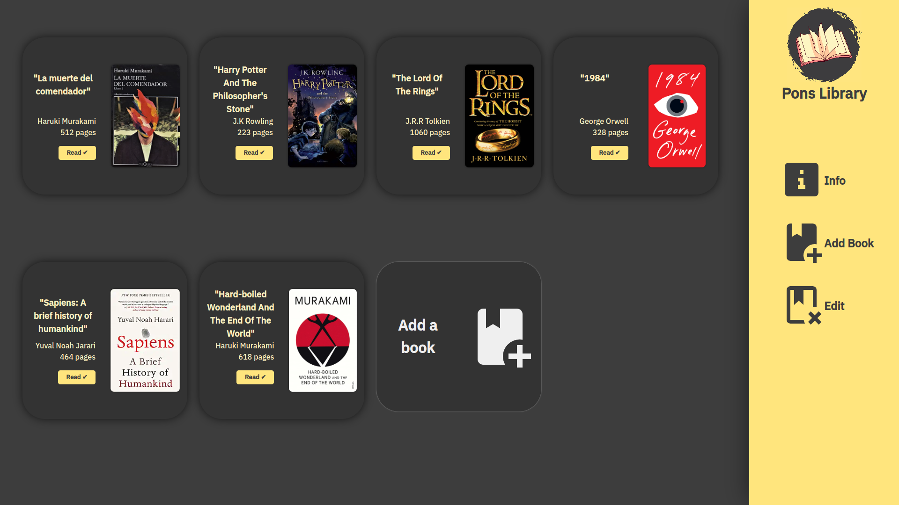

# Library-Project
This is the Library Project from The Odin Project JS course.

Welcome! I'm thrilled to share with you this project where I will focus on applying my recently acquired skills 
with Objects, prototypes and Object methods. 

In this project I also got to use Grid which I had just recently learned before starting the Javascript Course. 

But what I'm most excited about is that after quite a while, I get to work in a project where I build a dynamic
page by using HTML, CSS & Javascript!!

My goal for this year has been to finish TOP Full Stack JS course and find
my first Web Developer job. 

If you are a fellow TOP student reading this in a future where I have accomplished this goal, I hope you 
can find the motivation you are looking to keep going with this fascinating career!

You can now visit it here! https://max-pons.github.io/Library-Project/

